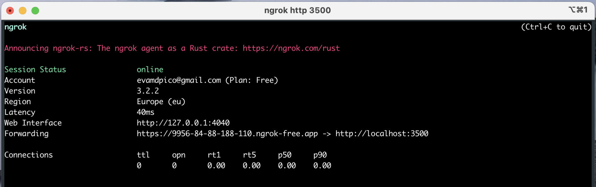
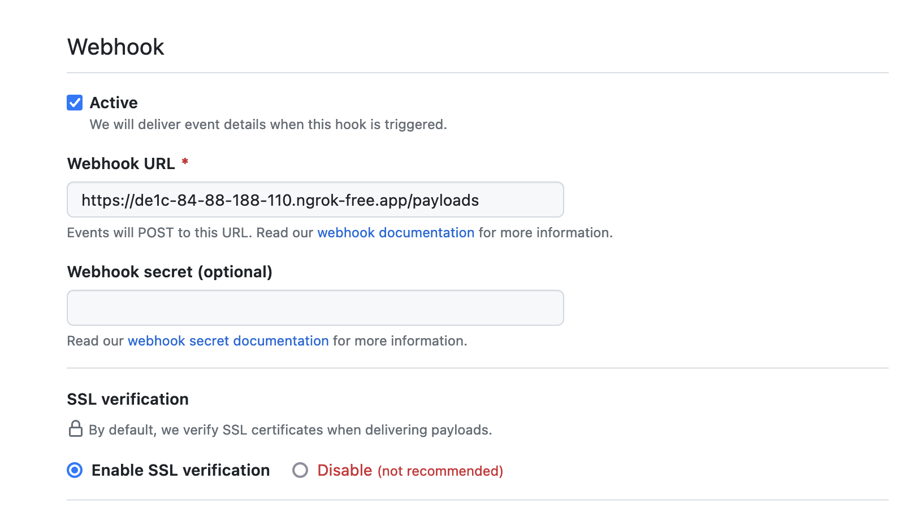

# FAIR4S Evaluator GitHub App API

This repository contains the API for the FAIR4S Evaluator GitHub App. The API is used by the FAIR4S Evaluator to communicate with GitHub. To do so, the FAIR4S Evaluator is registered as a [GitHub App](https://github.com/apps/fair4s-evaluator-test).

## Dev

To run the app locally:

```sh
npm install
npm run dev
```

Some features require this app to publicly accessible. To do so, you can use [ngrok](https://ngrok.com/). To run ngrok and make the apps port (3500) public, run the following command:

```sh
ngrok http 3500
```
It should return something like this: 




This exposes the app in a public URL (https://9956-84-88-188-110.ngrok-free.app in the above example). This URL can be used to configure the [GitHub app webhook](#github-app-webhook).

> To install and configure ngrok, follow [these steps](https://dashboard.ngrok.com/get-started/setup). Note that running ngrok requires a personal token that can be obtained from the [ngrok dashboard](https://dashboard.ngrok.com/get-started/your-authtoken). It needs registration.


## Interaction with GitHub APIs

### GraphQL API

The GraphQL API is used to get information about the repositories that have installed the FAIR4S Evaluator GitHub App. The GraphQL API is used to get the following information:
    - collaborators 
    - contactLinks
    - description 
    - descriptionHTML
    - homepageUrl
    - labels 
    - repositoryTopics
    - languages
    - primaryLanguage 
    - licenseInfo
    - packages
    - releases
    - submodules
    - visibility

An example of query for repository `evamart/mkdocs-template` is:

```graphql
{
  repository(owner: "evamart", name: "mkdocs-template") {
    description
    descriptionHTML
    homepageUrl
    isDisabled
    isEmpty
    isFork
    isInOrganization
    isLocked
    isMirror
    isPrivate
    isTemplate
    latestRelease {
      name
      tagName
    }
    licenseInfo {
      id
      name
      spdxId
      url
    }
    name
    mirrorUrl
    packages(first: 10) {
      edges {
        node {
          id
          name
          packageType
          version(version: "") {
            version
            summary
          }
        }
      }
    }
    releases(first: 10) {
      edges {
        node {
          id
        }
      }
    }
    url
    repositoryTopics(first: 10) {
      nodes {
        url
        topic {
          id
          name
        }
      }
    }
    collaborators(affiliation: ALL, first: 10) {
      nodes {
        email
        company
        id
        name
        websiteUrl
        url
      }
    }
  }
}
```

The result can be seen [here](./docs/metadataExample.json). 

> The query can be tested in the [GitHub GraphQL API Explorer](https://developer.github.com/v4/explorer/).

#### Transformation to Obeservatory data model 

Data from GitHub is all in `data.repostory` in the GraphQL response.

| GitHub API                   | Observatory data model    | Comment     |
|------------------------------|---------------------------|-------------|
| description (`str`)          | description (`str`)       |             |
| homepageUrl (`str`)          | webpage(`list`)             |             |
| isDisabled (`bool`)          | isDisabled (`bool`)       | NEW         |
| isEmpty (`bool`)             | isEmpty (`bool`)          | NEW         |
| isLocked (`bool`)            | isLocked (`bool`)         | NEW         |
| isPrivate (`bool`)           | isPrivate (`bool`)        | NEW         |
| isTemplate (`bool`)          | isTemplate (`bool`)       | NEW         |
| latestRelease.tagName (`dict`) | version (`list`)        |             |
| licenseInfo.name (`str`)     | license (`list`)          |             |
| licenseInfo.url (`str`)      | licenseURL (`list`)       | NEW         |
| licenseInfo.spdxId (`str`)   | licenseSPDXId (`list`)      | NEW         |
| name (`str`)                 | name (`str`)              |             |
| mirrorUrl (`str`)            | links(`list`)             |             |
| packages (`list`)            | -                         | Pending     |
| releases (`list`)            | version (`list`)          |             |
| url (`str`)                  | repository (`list`)       |             |
| repositoryTopics.nodes (`list`) |  -   | In github_topics* |
| repositoryTopics.nodes[i].url (`str`) | topics(`list`) | NEW |
| repositoryTopics.nodes[i].topic.name (`str`) | topics(`list`) | NEW |
| collaborators.nodes[i].name (`list`) | authors (`list`)  |             |
| isMirror (`bool`)            | -                         | *discarded* |
| isOrganization (`bool`)      | -                         | *discarded* |
| isFork (`bool`)              | -                         | *discarded* |
| descriptionHTML (`str`)      | -                         | *discarded* |


## GitHub App Webhook
Whenever a repository installs, unistalls or modifies in any way its permissions to the FAIR4S Evaluator App, the GitHub app sends a webhook to the FAIR4S Evaluator API. 
The webhok configuration is set in the [app settings](https://github.com/settings/apps/fair4s-evaluator-test): 



The webhook is sent to the URL xxxx/payloads. The webhook is sent in JSON format.

## Socket.io 

## Redis 

